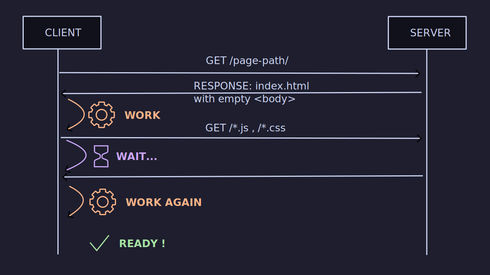

# 👻 Horror stories from running 🅰️ngular server side rendering in production 🚀 💥
---
- Hello, i'm very honored to be here.


## Hello 👋


- My name is [Benjamin Legrand](https://www.benjaminlegrand.net)
- 🤓 Lead Dev / Software architect
- 👔 work at [onepoint](https://www.onepoint.net)
- 🌍 Nantes, France
- [@benjilegnard](https://twitter.com/benjilegnard)
---
- I'm french (sorry), so I apologize in advance for my accent.
- I'm working for onepoint, we are a french consulting company, but with an eulisthic approach. 
- You can find me on twitter / x.


## Introduction


---
- I have been using angular since the AngularJS days, it is my framework of choice
- I worked on a lot of different projects through the years and some used server side rendering with Angular and some did'nt use it.
- I wanted to share some of the horror stories I've seen.
- From all the times we broke down production ( yes, it happens )


## Disclaimer #1

`@nguniversal/*`
       ===
`@angular/ssr`

<!-- .element: class="fragment" style="max-height: 30vh" -->

---
// image they're the same picture
- I'm gonna talk about server side rendering or universal, because it was the name of the library before.
- But now it's called @angular/ssr and has been integrated into core. It's the same thing, just a different name.
- Who here has used server side rendering with Angular ???


## Disclaimer #2

SSR with Angular is a lot better now
---
- This is not a diss talk on Angular or SSR.
- there has been a lot of improvements since.
- My stories are a little outdated, but the lessons learned are still relevant.


## Table of Contents

- server side rendering
- window is undefined
- memory leaks
- setTimeout
- transfer state
- inline critical css
---
- i am gonna talk about these subjects, and share some horror stories i've seen in production
- let's dive in, but first


### What is Server Side Rendering ?


#### "rendering" = creating HTML
---
- I know we are abusing the term. It is not about 3D graphics or video.
- But it is the process of creating the HTML of your app on the server side, before sending it to the client.


#### By default, angular is a client side framework
- "Single Page Application"

---
- Angular is a client side framework, it means that the HTML is created on the client side, in the browser.
- if you do nothing


#### SPA : ask the server for a page




```html 
<!DOCTYPE html>
<html lang="en">
<head>
  <meta charset="UTF-8">
  <title>My App</title>
</head>
<body>
  <app-root>
    <!-- NOTHING HERE -->
  </app-root>
  <script src="main.js"></script>
</body>
</html>
```
---
- You got an empty page, and only once main.js is loaded, the content of <app-root> will be created


#### SSR : ask the server for the HTML


---
- on server side rendering, you do not need to wait for the javascript to load to see the content.
- obviously this is still happening, but the HTML is already there.


#### Advantages of SSR

- SEO ( Search Engine Optimization )
- Performance ( faster loading times )<!-- .element: class="fragment" -->
- Usability ( your site is usable before javascript is loaded )<!-- .element: class="fragment" -->
- Universal / Isomorphic code ( same code on server and client )<!-- .element: class="fragment" -->
---
- Not really true for SEO anymore, search engines can index full JS and SPA apps.
- the main advantage in my humble opinion is the performance and loading times.
- the HTML is generated on server side and can be cached. 
- So you do not need to wait for the javascript to load to see the content.
- Write once, run anywhere


#### Inconvenients of SSR
- not for every app.<!-- .element: class="fragment" -->
- can be tricky, has some footguns.<!-- .element: class="fragment" -->
- paradigm change, not your typical SPA<!-- .element: class="fragment" -->
---
- If you have a loat of forms, and multi-step processses, and client side apis accesses... you might not want to use SSR.
- for simple content websites, it is great


#### Two execution contexts

Browser !== Server


| Browser | | Server |
| - | - | - |
| <!-- .element: style="max-width:20vw" --> | vs |  |
---
Node.js is based on the V8 engine, the same engine that powers Chrome. But running on the server.


| Browser | Server |
| - | - |
| window, navigator, geolocation, device, etc... | file system, network, OS APIs, etc... |
---
- On the browser side you will have acess to API that are not available on the server, and vice-versa
- window, document, navigator, geolocation, device => browser only
- server side, you have access to the filesystem, databases, network, etc.


#### How to add SSR to your Angular app

```bash
ng add @angular/ssr
```
---
- The schematics will add the necessary files and configurations to your app


#### In your Angular app :


##### Before

```diff
 .
 ├── src/
 │   ├── app/
 │   │   └── app.config.ts
 │   └── main.ts
 ├── tsconfig.json
 └── tsconfig.app.json
```
---


##### After

```diff
 .
 ├── src/
 │   ├── app/
 │   │   ├── app.config.ts
+│   │   └── app.config.server.ts
 │   ├── main.ts
+│   └── main.server.ts
+├── server.ts
 ├── tsconfig.json
 ├── tsconfig.app.json
+└── tsconfig.server.json
```
---
- you will have two entry points, one for the browser, one for the server
- and a specific tsconfig for the server


```no-highlight
.
└── dist/
    ├── browser/ 
    │   ├── index.html
    │   └── main.js 
    └── server/
        ├── index.html
        └── main.js
```
---
- Your app will be build for the two context
- now that I have explained all this, let's dive into the horror stories.


### Window is undefined


#### Context ?

- big project, 50+ Developers
- lots of daily pull-requests
- very fast code reviews...
---
- code reviews were not very efficient


#### What happened ?


---
- One day I'm at my desk, it was before covid times
- Some developer comes to me "The app is broken, it's not working anymore"


#### What happened ?
- someone added a third-party library
- that used the window object<!-- .element: class="fragment" -->
---
- we add safe-guards for the window objects


#### What (really) happened.
- Developers were not using the "SSR" devmode
- "because it is slower"<!-- .element: class="fragment" -->
---
- the real root cause
- lessons learned : prioritize developer experience


#### Solutions
---
- Let's see some solutions to this problem


##### Recommended solution

```typescript [|5|7-9]
@Injectable({
  providedIn: 'root'
})
export class WindowService {
  private document: Document = inject(DOCUMENT);
  
  get window(): Window {
    return this.document.defaultView;
  }
}
```
---
- The recommended solution from angular docs.
- use the DOCUMENT token to get the window object
- this not the real document, but a server implementation called domino.
- this works when you are directly using window, but in our case we did not.


##### Quick and dirty fix

```typescript
globalThis['window'] = {
  // properties you need implemented here...
};
```
---
- This works if you were not the one calling window function directly
- But you might need to have a lot of "mocked" properties for server.
- Not your job to re-implement browser APIs


##### A better solution

```typescript [|1|8|11-14|15-16]
import { isPlatformBrowser } from '@angular/common';
import { PLATFORM_ID } from '@angular/core';

@Injectable({
  providedIn: 'root'
})
export class MyService {
  private platformId = inject(PLATFORM_ID);

  async loadLibrary() {
    if (isPlatformBrowser(this.platformId)) {
      // do something on browser only
      return await import('external-ib');
    }
    // server only case
    return undefined;
  }
}
```
---
- setup a wrapper Service around the third-party library
- condition your code with isPlatformBrowser/isPlatformServer
- use injection tokens 


##### A very BAD solution

Please do not use `fileReplacements` for this
```json
{
  "configurations": {
    "server": {
      "fileReplacements": [
        {
          "replace": "src/app/assets.service.ts",
          "with": "src/app/assets.service.server.ts"
        }
      ]
    }
  }
}
```
---
- this is an extract from the angular.json file
- The replacement file is not compiled linted / tested with the rest of the application
- fileReplacements are a way to replace a file in your build process
- this means the "server" file are not compiled / tested with the rest of the application


##### Another (good) solution

 
---
- let's say i have a service that fetches assets, and i want to use a different implementation on server side and browser side.
- to not make an HTTP request to load a file that is already in my assets folder


##### Another (good) solution
use injection tokens: 
```typescript
interface AssetsFetcher {
  fetchAssets<T>(): Promise<T>;
}

export const ASSETS_FETCHER = new InjectionToken<
    AssetsFetcher>('ASSETS_FETCHER');
```
---
- Since we cannot inject an interface directly, we need to use an InjectionToken


`app.config.ts`
```typescript [|6-9]
import { ASSETS_FETCHER } from './assets-fetcher';
import { AssetsFetcherBrowserService } from './assets-fetcher-browser.service';

export const appConfig: ApplicationConfig = {
    providers: [
        {
            provide: ASSETS_FETCHER,
            useClass: AssetsFetcherBrowserService
        }
    ]
};
```


`app.server.config.ts`
```typescript [|13-16]
import {
        ApplicationConfig,
        mergeApplicationConfig,
} from "@angular/core";

import { appConfig } from "./app.config";
import { AssetsFetcherServerService } from "./services/assets/assets-fetcher.server.service";
import { ASSETS } from "./services/assets/assets-fetcher.token";

const serverConfig: ApplicationConfig = {
  providers: [
    provideServerRendering(),
    {
      provide: ASSETS_FETCHER,
      useClass: AssetsFetcherServerService
    },
  ],
};

export const config = mergeApplicationConfig(appConfig, serverConfig);
```


#### Takeaways
- always use the SSR dev mode
- think about the two execution contexts
- clearly separate code paths
---
Now let's talk about memory leaks...


### Oups... a memory leak


#### Context ?
- huge project with 50+ developers
- one production release per sprint
- ~= 1 million daily page views.


#### Deployment metrics
---
- I'm gonna show some graphes, that i re-drew myself
- cause at the time i was to dumb to take screenshots


---
This was how we deployed "normally", when everything was fine.


---
In reality we had two virtual machines for.


#### What happened ?


---
- we released a new version and BOOM.
- this, kids, is a memory leak


#### What was the root cause ?
Someone pushed this code:

```typescript
@Injectable({
  providedIn: 'root'
})
export class MyService {
  constructor(otherService: OtherService) {
    this.otherService.observable$.subscribe(() => {
      // do something
    });
  }
}
```
---
- Can you spot the issue ?
- no unsubscription


#### What is the issue
- the Observer pattern leaks
<!-- TODO: schema / link between objects -->


#### Other source of memory leaks
- addEventListener()
- removeEventListener()<!-- .element: class="fragment" -->


#### Solutions ?
- __always__ unsubscribe
- do not use the constructor to initialize observables
- use "init" methods instead
- avoid `providedIn: root` when you can.


### The setTimeout trap


#### Context ?
- consulting on a new project
- first task: "please fix the SSR performance"


#### What was happening ?

---
- every request was taking 10 seconds to respond<!-- .element: class="fragment" -->


#### What happened ?
- investigating... 🕵️ 
- found this code<!-- .element: class="fragment" -->
---
- add logs, add performance metrics for every request.


```typescript [|3|4-6|9-25]
class MyService {
    
  private maxRetries: number = 4;
  private sleep: (ms: number | undefined) => Promise<unknown> = (
    ms: number | undefined,
  ) => new Promise((r) => setTimeout(r, ms));

    
  public async sendMessageEvent(message: string): Promise<Status> {
  
		let sendEventStatus = this.postMessageToIframe(message);

		if (sendEventStatus !== "OK") {
			let retry = 0;
			while (
				sendEventStatus !== Status.OK &&
				retry < this.maxRetries
			) {
				retry++;
				await this.sleep(2000);
				sendEventStatus = this.postMessageToIframe(event);
			}
		}
		return sendEventStatus;
  }
}
```
---
- first suspition: retry + sleep, this smells bad
- and then what was retried ? a communication system with an iframe
- this method was called on an APP_INITIALIZER, so it was blocking the app initialization for every request


#### What was the issue ?
- zone.js 🫠 
- will wait for any callback / promise / microtask to finish<!-- .element: class="fragment" -->
- artificial delays<!-- .element: class="fragment" -->


#### Also
- There is no `window` on the server.
- There is no `iframe` either.
---
This code was totally useless on the server


#### Solutions
- avoid using `setTimeout` / `setInterval` in SSR
- (same thing for rxjs `delay` / `interval` / timing operators)
- condition them to run only in browser mode<!-- .element: class="fragment" -->


#### Takeways 
- be careful with timeouts and intervals
- avoid artificially delaying the server response times.


### Help, my API is requested twice.


#### Context ?
- an app that fetches json data from an api to render 
- pretty standard stuff<!-- .element: class="fragment" -->


#### What is the issue ?
- new deployment.
- put twice the load
- cache the html render
- but it is not he same client side


#### solution
- transfer state to the rescue
- how do I implement ?


#### Takeaways
- think about the cacheability of your data
- two execution contexts, two requests


### The "scandal" of Inline Critical CSS


#### Context ? 
- huge project, 50+ developers<!-- .element: class="fragment" -->
- one production release per sprint<!-- .element: class="fragment" -->
- 🥶 "code freeze" for 3 sprints during christmas 🎅<!-- .element: class="fragment" -->
- = one HUGE release<!-- .element: class="fragment" -->


#### What happened ?


---
- This was the "normal" deployment baseline.
- And then, we had the "post code freeze" deployment


---
- as you can see, the CPU usage went through the roof
- and for EVERY REQUESTS, the response time was 300ms longer than before 
- load balancing was doing its job, and started more and more VMs to handle the load


#### What (really) happened ?
- angular 12 upgrade was in the release<!-- .element: class="fragment" -->
- inline critical css "feature" was enabled by default<!-- .element: class="fragment" -->


#### What is critters ?


---
- besides having a cute logo


#### Solutions


##### Quick and dirty fix
- do not inline critical css


`server.ts`
```diff
// how to disable
```


`angular.json`
```diff 

```


##### A better solution

- use critter comments
```HTML
<!-- critters:ignore -->
```


#### takeaways
- avoid big releases
- release early, release often


### The invisible infrastructure


#### Context ?

- Again, I was asked to "fix the SSR" on a project


- This was their architecture ( //todo schema )


#### What is the issue ?

= server side renderer always failed


#### Solutions:
- alerts and observability
- do not run your code without logs
- spa fallback is a good idea but:
- do not hide the errors
- a 500 error should NEVER happen


### The Localization Hell


#### Context ?
- multi-language app
- multi-country apps
- O(n) problem


#### What is the issue ?
- build times
- deployment times


#### solutions 

- dynamic lang, do not build an app per multi-language

solution 1 : multiple apps, multiples build
- beware of the locale problem
- better solution : Accept-Language header 
- do not mix server lang source and browser lang sources 


### Lighthouse said our Content layout shift is bad


#### context
  - let's say we have a banner, you don't want it 
  -


#### what happened / the problem
  - now on loading


#### explaination
- what is content layout shift


#### solutions
  - do not use local storage to store persistent page state.
  - use query params or cookies
  - take the cookies into consideration in the cache key


### Hydration ? not with this framework


#### context
- hydratation ?


#### the problem:
- big loading time
- page was emptied / re-rendered
- huge cpu spike


#### solutions
- preboot library
- angular 16 to the rescue


## Conclusion

- Should you still do server-side-rendering?
- yes<!-- .element: class="fragment" -->
---
- for performance, it is worth it
- just know the traps and gotchas to avoid failures
- educate your peers, and ops
- monitor your app, watch logs and metrics


- 🔍 observability is key 🔑 
- 🚨 logs, metrics, alerts <!-- .element: class="fragment" -->
- ⚡ performance matters<!-- .element: class="fragment" -->
- ⚠️ do not hide errors<!-- .element: class="fragment" -->
- 🤓 share knowledge<!-- .element: class="fragment" -->
---
- put the same care in your frontend regarding obs and ops than in your backend
- tell your peers, ops, not a standard spa


## Thank you

<a href="https://openfeedback.io/2024-09-20-etech-day/2024-09-20/z0BhXl2GBSDXfjtd3s1U">
  
</a>


### 

- slide code: attention à regrouper / faire suivre
- typos: hydration / with / library
- french in the slides
