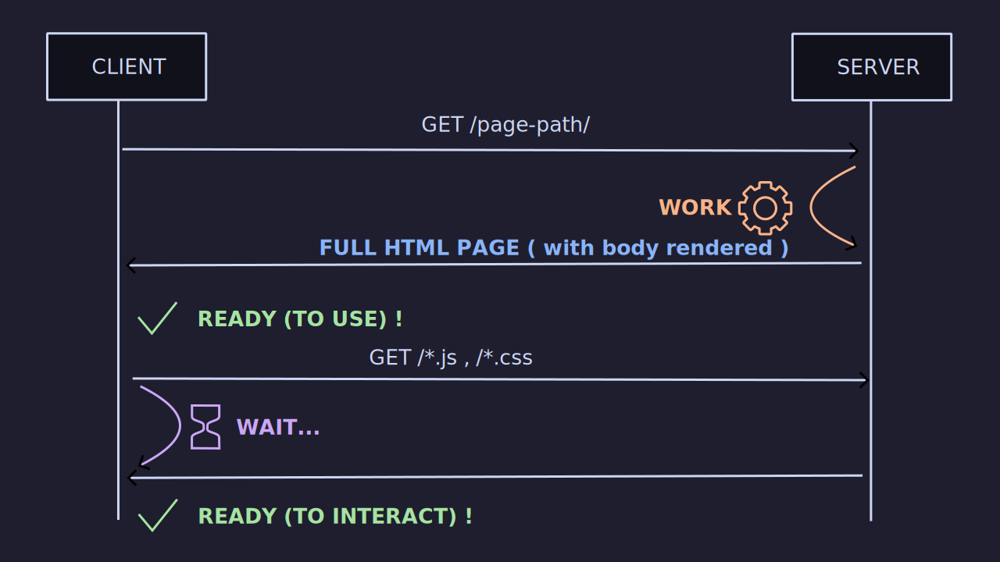

# 👻 Horror stories from running 🅰️ngular server side rendering in production 🚀 💥
---
- Hello, i'm very honored to be here.


## Hello 👋


- My name is [Benjamin Legrand](https://www.benjaminlegrand.net)
- 👔 Tech Lead @ [onepoint](https://www.onepoint.net)
- 🌍 Nantes, France
- [@benjilegnard](https://twitter.com/benjilegnard)
---
- I'm french (sorry), so I apologize in advance for my accent.
- I'm working for onepoint, we are a french consulting company, but with an eulisthic approach. 
- You can find me on twitter / github / linkedin and other sites with the same username


## Introduction


---
- I have been using angular since the AngularJS days, it is my favourite front-end framework
- I worked on a lot of different projects through the years and some used server side rendering with Angular and some did'nt use it.
- I wanted to share some of the horror stories I've seen.
- From all the times we broke down production ( yes, it happens )


## Disclaimer #1

`@nguniversal/*`
       ===
`@angular/ssr`

<!-- .element: class="fragment" style="max-height: 30vh" -->

---
- they're the same picture
- I'm gonna talk about server side rendering or universal, because it was the name of the library before.
- But now it's called @angular/ssr and has been integrated into core. It's the same thing, just a different name.


## Disclaimer #2

- This is not a diss talk
- SSR with Angular is a lot better now
---
- This is not a diss talk on Angular or SSR.
- there has been a lot of improvements since.
- My stories are a little outdated, but the lessons learned are still relevant.


## Table of Contents

- server side rendering
- window is undefined
- memory leaks
- setTimeout
- transfer state
- inline critical css
---
- i am gonna talk about these subjects, and share some horror stories i've seen in production
- let's dive in, but first
- Who here has used server side rendering with Angular ???


### What is Server Side Rendering ?
---
- Note: I will include pre-rendering in these definitions.


#### "rendering" = creating HTML
---
- I know we are abusing the term. It is not about 3D graphics or video.
- Don't tell game developers about this rendering, they'll laugh at you.
- In our context, it is the process of creating the HTML of your app on the server side, before sending it to the client.


#### By default, Angular is a client side framework

---
- if you do nothing, by default, angular generates a single page app
- client side means that the HTML is created in the browser.


#### SPA : ask the server for a page


---
- you just need "dumb" servers : simple static files hosting
- in apache httpd or nginx for example.


#### SPA : you get nothing.
```html 
<!DOCTYPE html>
<html lang="en">
<head>
  <meta charset="UTF-8">
  <title>My Single Page App</title>
</head>
<body>
  <app-root>
    <!-- NOTHING HERE, (or maybe, a loader?) -->
  </app-root>
  <script src="main.js"></script>
</body>
</html>
```
---
- You got an empty page, and only once main.js is loaded, the content of \<app-root\> will be created


#### SSR : ask the server for the HTML


---
- on server side rendering, you do not need to wait for the javascript to load to see the content.
- obviously this is still happening, but the HTML is already there.


#### Advantages of SSR

- 🔎 SEO<br/>( Search Engine Optimization )
- 🚀 Performance<br/>( faster loading times )<!-- .element: class="fragment" -->
- ♿ Usability / accessibility<br/>( your site is usable before javascript is loaded )<!-- .element: class="fragment" -->
- 🧑‍💻Universal / Isomorphic code<br/>( same code on server and client )<!-- .element: class="fragment" -->
---
- Not really true for SEO anymore, search engines can index full JS and SPA apps.
- the main advantage in my humble opinion is the performance and loading times.
- And you do not need javascript to load to use the site and see contents
- Same codebase and templates for client and server, write once, run anywhere, remember JSP? PHP?


#### Drawbacks of SSR
- not for every app/site.<!-- .element: class="fragment" -->
- can be tricky, has some footguns.<!-- .element: class="fragment" -->
- paradigm change, not your typical SPA<!-- .element: class="fragment" -->
---
- If you have a loat of forms, or multi-step processses, and client side apis accesses... 
- you might not want to use SSR.
- same thing if all your site is private or behind authentification.
- for simple content websites that are PUBLIC, it is great.


#### Two execution contexts

Browser !== Server


| Browser | | Server |
| - | - | - |
| <!-- .element: style="max-width:20vw" --> | vs |  |
---
Node.js is based on the V8 engine, the same engine that powers Chrome. But running on the server.


| Browser | Server |
| - | - |
| window, navigator, geolocation, device, etc... | file system, network, OS APIs, etc... |
---
- On the browser side you will have access to APIs that are not available on the server, and vice-versa
- window, document, navigator, geolocation, device => browser only
- server side, you have access to the filesystem, databases, network, operating system of your server, etc.


#### How to add SSR to your Angular app

```bash
ng add @angular/ssr
```
---
- The schematics will add the necessary files and configurations to your app


#### In your Angular app :


##### Before

```diff
 .
 ├── src/
 │   ├── app/
 │   │   └── app.config.ts
 │   └── main.ts
 ├── tsconfig.json
 └── tsconfig.app.json
```
---
- this is the default SPA common files that you have in an angular project


##### After

```diff
 .
 ├── src/
 │   ├── app/
 │   │   ├── app.config.ts
+│   │   └── app.config.server.ts
 │   ├── main.ts
+│   └── main.server.ts
+├── server.ts
 ├── tsconfig.json
 ├── tsconfig.app.json
+└── tsconfig.server.json
```
---
- with SSR, you will now have two entry points, one for the browser, one for the server
- a specific app.config.server.ts file
- and a also, a specific tsconfig for the server


```no-highlight
.
└── dist/
    ├── browser/ 
    │   ├── index.html
    │   └── main.js 
    └── server/
        ├── index.html
        └── main.js
```
---
- ... because your app will be built for the two contexts.
- now that I have explained all this, let's dive into the spooky stories.


### Window is undefined


#### Context ?

- 👥 Big project, 30+ Developers
- 📚 Lots of daily pull-requests
- ⚡ Very fast code reviews... <span class="fragment">maybe too fast</span>
---
- i was technical manager on this project
- so anything not working technically was my fault :D
- code reviews were not very efficient


#### What happened ?


---
- One day I'm at my desk, it was before covid times
- Some developer comes to me "The app is broken, it's not working anymore"


---
- Other developers come to my desk: we have a "window is undefined" error
- Then others "The front-end is broken"


---
- Everyone had the same message "window is undefined" displayed in the page contents instead of the website.


---
- pretty soon every one from the project is on my back, because they can't use the front-end
- obviously we caught this before production but still, it was bad.


#### What happened ?
- 👮 We had safe-guards about not using browser globals. but...
- 📙 "Someone" added a third-party library<!-- .element: class="fragment" -->
- 🪟 that used the window object<!-- .element: class="fragment" -->
---
- we had safe-guards and things to check during code-reviews
- but this was not enough


#### What (really) happened.
- ♻️ Developers were not using the "SSR" devmode, only SPA
- 🐌 "because it is slower"<!-- .element: class="fragment" -->
---
- the real root cause, there is always a deeper cause (look for fish bone analysis)
- lessons learned : prioritize developer experience


#### Solutions
---
- Let's see some solutions to this problem


##### Recommended solution

```typescript [|5|7-9]
@Injectable({
  providedIn: 'root'
})
export class WindowService {
  private document: Document = inject(DOCUMENT);
  
  get window(): Window {
    return this.document.defaultView;
  }
}
```
---
- The recommended solution from angular docs.
- use the DOCUMENT token to get the window object
- this not the real document, but a server implementation called domino, but it is good enough is most cases.
- this works when you are directly using window, but in our case we did not. The third-party library was.


##### Quick and dirty fix

```typescript
globalThis['window'] = {
  // properties you need implemented here...
};
```
---
- This works if you were not the one calling window function directly
- But you might need to have a lot of "fake" properties for server.
- It is not your job to re-implement browser APIs.


##### A better solution

```typescript [|1|8|11-14|15-16]
import { isPlatformBrowser } from '@angular/common';
import { PLATFORM_ID } from '@angular/core';

@Injectable({
  providedIn: 'root'
})
export class MyService {
  private platformId = inject(PLATFORM_ID);

  async loadLibrary() {
    if (isPlatformBrowser(this.platformId)) {
      // do something on browser only
      return await import('external-ib');
    }
    // server only case
    return undefined;
  }
}
```
---
- setup a wrapper Service around the third-party library
- condition your code with __isPlatformBrowser__ / __isPlatformServer__
- this is my favorite way, because you have clear code paths for the 2 contexts...
- a better solution could be to use injection tokens, but before that. 


##### A very BAD solution

Please do not use `fileReplacements` for this
```json
{
  "configurations": {
    "server": {
      "fileReplacements": [
        {
          "replace": "src/app/assets.service.ts",
          "with": "src/app/assets.service.server.ts"
        }
      ]
    }
  }
}
```
---
- this is an extract from the angular.json file of another project.
- fileReplacements are a way to replace a file during your build process
- It is bad because the replacement file is not compiled linted / tested / run in dev mode with the rest of the application


##### Another (good) solution

 
---
- let's say i have a service that fetches assets, and i want to use a different implementation on server side and browser side.
- to not make an HTTP request to load a file that is already in my assets folder.
- I wanted a different implementation on server side to avoid network access, and optimize performance.
- so the server side use readFile from node.js and the browser side makes an HttpClient request.


##### Another (good) solution
use injection tokens: 
```typescript
interface AssetsFetcher {
  fetchAssets<T>(): Promise<T>;
}

export const ASSETS_FETCHER = new InjectionToken<
    AssetsFetcher>('ASSETS_FETCHER');
```
---
- Since we cannot inject an interface directly, we need to use an InjectionToken
- remember kids, typescript interfaces only exists in you mind.


`app.config.ts`
```typescript [|6-9]
import { ASSETS_FETCHER } from './assets-fetcher';
import { AssetsFetcherBrowserService } from './assets-fetcher-browser.service';

export const appConfig: ApplicationConfig = {
    providers: [
        {
            provide: ASSETS_FETCHER,
            useClass: AssetsFetcherBrowserService
        }
    ]
};
```
---
- here we provide the browser implementation inside _app.config.ts_


`app.server.config.ts`
```typescript [|13-16]
import {
        ApplicationConfig,
        mergeApplicationConfig,
} from "@angular/core";

import { appConfig } from "./app.config";
import { AssetsFetcherServerService } from "./services/assets/assets-fetcher.server.service";
import { ASSETS } from "./services/assets/assets-fetcher.token";

const serverConfig: ApplicationConfig = {
  providers: [
    provideServerRendering(),
    {
      provide: ASSETS_FETCHER,
      useClass: AssetsFetcherServerService
    },
  ],
};

export const config = mergeApplicationConfig(appConfig, serverConfig);
```
---
- and the server implementation in _app.server.config.ts_


#### Takeaways
- ♻️ Always use the SSR dev mode<!-- .element: class="fragment" -->
- 🧠 Think about the two execution contexts<!-- .element: class="fragment" -->
- ✂️ Clearly separate code paths<!-- .element: class="fragment" -->
---
- Now let's talk about memory leaks...


### Oups... a memory leak


---
- Our next story is about memory leaks
- It is sad that we often miss this in front-end world.
- Thanks to garbage collection
- "Just close the tab bro", "Just restart your browser"
- You can't be that careless on the server.


#### Context ?
- 👥 Huge project with 50+ developers
- 🚀 One production release per sprint<!-- .element: class="fragment" -->
- 📈 ~= 1 million daily page views<!-- .element: class="fragment" -->


#### Deployment metrics
🤓
---
- I'm gonna show some graphes, that I re-drew myself
- Because at the time, I was to dumb to take screenshots


---
- This was how we deployed "normally", when everything was fine.
- Old VM stops to the left, New VM's starts to the right.


---
In reality we had (on average) two virtual machines, so this looked more like this.


#### What happened ?


---
- we deployed a new version and BOOM.
- you can see memory always going up. Until it reaches the limit, and crashes, then another VM starts.
- this, kids, is a memory leak
- meanwhile, CPU is used to try to free memory instead of answering requests, worse, some requests are not answered.


#### What was the root cause ?
Someone pushed this kind of code:

```typescript
@Injectable({
  providedIn: 'root'
})
export class MyService {
  constructor(otherService: OtherService) {
    this.otherService.observable$.subscribe(() => {
      // do something
    });
  }
}
```
---
- Can you spot the issues ?
- 1. no unsubscription
- 2. providedIn root


#### What is the issue ?
- 🔭 the Observer pattern leaks

---
- when two functions / object know about each other.
- the garbage collection can't identify them to remove them from memory.
- and they stay here event after the requests ends.


#### Other source of memory leaks
- addEventListener()<!-- .element: class="fragment" -->
- removeEventListener()<!-- .element: class="fragment" -->
---
- rjxs is not the only one to blame for memory leaks,
- also event listeneres are not the only one way to leak, but the most common.


#### Second issue:
- {providedIn:'root'}.<!-- .element: class="fragment" -->
- means the service was instanciated for EVERY page.<!-- .element: class="fragment" -->
---
- even though it was used only on one page


#### Solutions ?
- 👮 always unsubscribe / 🧹 cleanup behind you<!-- .element: class="fragment" -->
- 🚫 do not use the constructor to initialize observables<!-- .element: class="fragment" -->
- 👍 use "init" methods instead<!-- .element: class="fragment" -->
- ⛔ avoid providedIn:root when you can<!-- .element: class="fragment" -->
---
- use ngOnDestroy, takeUntil or untilDestroyed, and subscribe closer to your components templates, not in services.
- initialisation methods helps you to know who and when called the method
- with a constructor, you do not really know explicitly when it is called: the framework does it for you
- any thing that can be lazy loaded, deferred, instanciated later, should be.


### The setTimeout trap


#### Context ?
- 🏗️ Consulting on a "recent" project
- 👶 First task: "please fix the SSR performance"
---
- project was new (6-8 months), and just went to production


#### What was happening ?

---
- every request was taking 10 seconds to respond<!-- .element: class="fragment" -->


#### What happened ?
-  🕵️ investigating... 🕵️ 
- found this code<!-- .element: class="fragment" -->
---
- first things I did, add logs, add performance metrics for every request.
- http requests made on the server where fast, no issue there.
- still 10 seconds to render a page


```typescript [|3|4-6|9-25]
class MyService {
    
  private maxRetries: number = 4;
  private sleep: (ms: number | undefined) => Promise<unknown> = (
    ms: number | undefined,
  ) => new Promise((r) => setTimeout(r, ms));

    
  public async sendMessageEvent(message: string): Promise<Status> {
  
		let sendEventStatus = this.postMessageToIframe(message);

		if (sendEventStatus !== "OK") {
			let retry = 0;
			while (
				sendEventStatus !== Status.OK &&
				retry < this.maxRetries
			) {
				retry++;
				await this.sleep(2000);
				sendEventStatus = this.postMessageToIframe(event);
			}
		}
		return sendEventStatus;
  }
}
```
---
- first suspicious code: retry + sleep, this smells bad
- and then what was retried ? a communication system with an iframe
- this method was called on an __APP_INITIALIZER__, so it was blocking the app initialization for every request.
- until an iframe responded... not. so we were retrying 4 times * 2 + the 2 seconds initial wait. There it is.


#### What was the issue ?
- zone.js 🫠 
- server render will wait for ApplicationRef.isStable()<!-- .element: class="fragment" -->
- will wait for any callback / promise / microtask to finish<!-- .element: class="fragment" -->
- artificial delays<!-- .element: class="fragment" -->
---
- app stability is important. Do not start timers if not needed.


#### Also:
- There is no `window` on the server.
- There is no `iframe` either.
---
- This code was totally useless on the server


#### Solutions
- avoid using `setTimeout` / `setInterval` in SSR
- (same thing for rxjs `delay` / `interval` / timing operators)
- condition them to run only in browser mode<!-- .element: class="fragment" -->


#### Takeaways 
- ⚠️ be careful with timeouts and intervals.
- 🤖 avoid artificially delaying the server response times.


### Help, my API is requested twice.


#### Context ?
- an app that fetches json data from an api to render.
- pretty standard stuff<!-- .element: class="fragment" -->
- backend service already existed<!-- .element: class="fragment" -->


#### What is the issue ?
- 🚀 new deployment.
- 🚚 put twice the load on the backend.


---
- what happened was a request made for server side rendering
- was made again on the client browser.


#### Solution
- TransferState<!-- .element: class="fragment" -->
- HttpInterceptor using it<!-- .element: class="fragment" -->
---
- Angular / nguniversal had solutions for that issue : the TransferState
- it is a key value store that is shared between the server and the client 
- it helps avoid useless requests
- used in modern angular to transfer hydration state


#### Transfer What ?
```html 
<!DOCTYPE html>
<html lang="en">
  <body>
    <!-- ... -->
    <script id="ng-state">
        {
                "http://api.domain.de/resource": {
                    "data": {/** ... */}
                }
        }
    </script>
  </body>
</html>
```
---
- the transfer state is a script tag in the html. 
- the angular HttpClient will use it to get results if they exists in there.


---
- there it is, problem solved


#### Actually:
- transfer state is now included by default with `provideServerRendering()`
- you had to explicitly enable it before<!-- .element: class="fragment" -->


#### Takeaways
- 🧑‍🤝‍🧑two execution contexts, two requests
- 🧠think about the cacheability of your data
---
- The transfer state is good for performance.
- But can be tricky if you have cache and need to have up-to-date data.


### The "scandal" of Inline Critical CSS


#### Context ? 
- 👥 huge project, 50+ developers<!-- .element: class="fragment" -->
- 🚀 one production release per sprint<!-- .element: class="fragment" -->
- 🥶 "code freeze" for 3 sprints during christmas 🎅<!-- .element: class="fragment" -->
- = one HUGE release<!-- .element: class="fragment" -->
---
- code freeze is not when you stop coding or adding features, it is when you stop deploying / releasing '-_-


#### What happened ?


---
- This was the "normal" deployment baseline.
- And then, we had the "post code freeze" deployment


---
- as you can see, the CPU usage went through the roof
- and for EVERY REQUESTS, the response time was 300ms longer than before 
- load balancing was doing its job, and started more and more VMs to handle the load


#### Investigation
- 🚑 git bisect ( ~= 700 commits )<!-- .element: class="fragment" -->
- 🤔 what changed ? what are we looking for ?<!-- .element: class="fragment" -->
- ⏱️ While we're looking, hosting the app costs... 💸<!-- .element: class="fragment" -->
- 🎉 thanks to [0x](https://www.npmjs.com/package/0x), and the flamegraph<!-- .element: class="fragment" -->
---
- git bisect is a tool that helps you find the commit that introduced a bug
- but we could not really reproduce the heavy load on our local machines
- then one day, we found the culprit, with the help of 0x, a flamegraph tool for node.js
- a lot of traces mentioning "critters"


#### What (really) happened ?
- Angular 12 upgrade was in the release<!-- .element: class="fragment" -->
- `inlineCriticalCss` feature was enabled by default<!-- .element: class="fragment" -->


#### What is critters ?


---
- besides having a cute logo


---
- critters is supposed to help you enhance the critical CSS performance.
- what is critical CSS


---
- It is the most important CSS of your page, the one that is visible first


---
Issue, we had pages with HUGE DOM, so critters spent a lot of time parsing it, and it was not even critical.


#### Solutions


##### Quick and dirty fix
- do not inline critical css


`server.ts`
```diff
    commonEngine
      .render({
        bootstrap,
        documentFilePath: indexHtml,
        url: `${protocol}://${headers.host}${originalUrl}`,
        publicPath: distFolder,
+        inlineCriticalCss: false,
        providers: [
          { provide: APP_BASE_HREF, useValue: baseUrl },],
      })
      .then((html) => res.send(html))
      .catch((err) => next(err));
```


`angular.json`
```diff 
{
    // ...
    "configurations": {
        "production": {
            "optimization": {
                "fonts": true,
                "scripts": true,
                "styles": {
+                    "inlineCritical": false,
                    "minify": true
                }
            }
        },
    },
    // ...
}
```


##### A better solution

- use critter comments in HTML
```HTML
<html>
  <body>
    <div class="container">
      <div data-critters-container>
        /* HTML inside this container are used to evaluate critical CSS */
      </div>
      /* HTML is ignored when evaluating critical CSS */
    </div>
    <footer></footer>
  </body>
</html>
```


- or in CSS
```css
/* critters:exclude start */

.selector1 {
  /* this rule will be excluded from critical CSS */
}

.selector2 {
  /* this rule will be excluded from critical CSS */
}

/* critters:exclude end */
```


#### takeaways
- 🚚 avoid big releases
- 📆 release early, release often
- 📦 load testing is important
- 🤓 read the changelogs.


### The invisible infrastructure


#### Context ?

- Again, I was asked to "fix the SSR" on a project


- This was their architecture ( //todo schema )


#### What is the issue ?

= server side renderer always failed


#### Solutions:
- alerts and observability
- do not run your code without logs
- spa fallback is a good idea but:
- do not hide the errors
- a 500 error should NEVER happen


### The Localization Hell


#### Context ?
- multi-language app
- multi-country apps
- O(n) problem


#### What is the issue ?
- build times
- deployment times


#### solutions 

- dynamic lang, do not build an app per multi-language

solution 1 : multiple apps, multiples build
- beware of the locale problem
- better solution : Accept-Language header 
- do not mix server lang source and browser lang sources 


### Our Core Web Vitals are bad.


#### context
  - let's say we have a banner, you don't want it 
  -


#### what happened / the problem
  - now on loading


#### explaination
- what is content layout shift


#### solutions
  - do not use local storage to store persistent page state.
  - use query params or cookies
  - take the cookies into consideration in the cache key


### Hydration ? not yet. 


#### context
- hydratation ?


#### the problem:
- big loading time
- page was emptied / re-rendered
- huge cpu spike


#### solutions
- preboot library
- angular 16 to the rescue


## Conclusion

- 🤔 Should you still do server-side-rendering?
- Yes<!-- .element: class="fragment" -->
---
- for performance, it is worth it
- just know the traps and gotchas to avoid failures
- educate your peers, and ops
- monitor your app, watch logs and metrics


- 🔍 observability is key 🔑 
- 🚨 logs, metrics, alerts <!-- .element: class="fragment" -->
- ⚡ performance matters<!-- .element: class="fragment" -->
- ⚠️ do not hide errors<!-- .element: class="fragment" -->
- 🤓 share knowledge<!-- .element: class="fragment" -->
---
- put the same care in your frontend regarding obs and ops than in your backend
- tell your peers, ops, not a standard spa


## Thank you


@benjilegnard
---
- Thank you for listening
- If you need to scream at me... I'm on twitter.
